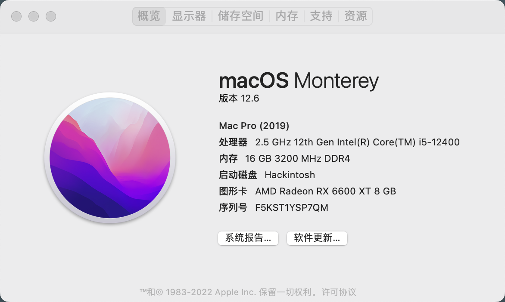

## 说明

本文仅记录最简化的步骤流程，因为发现前面折腾了好久都是多余的步骤，实际上参照cpu架构的说明文档简单靠谱。

https://github.com/luchina-gabriel/BASE-EFI-INTEL-DESKTOP-12THGEN-ALDER-LAKE

**目前我的一切正常，使用和白苹果无差异。(从 12.3 直接升级到了 12.6 无问题）**

所以如果下次再搞黑苹果，流程大概是：

1. 确定是全新组机还是在旧设备上做增量。建议都优先选用得多的。
2. 搜索对应cpu架构支持情况，如果搜不到就直接搜对应型号
3. 搜索对应主板的efi文件，基本能复用 ACPI 和 kexts
4. 规划好硬盘，一定要是 GPT 分区表

## 基本配置

cpu: intel 12400

主板：铭瑄 b660m 终结者

硬盘：WD Blue SN570 500GB

显卡：迪兰 AMD ADEON RX6600xt 

OC 版本：0.8.4

无线网卡：**无（所以我没有打蓝牙和无线网卡的驱动）**

## 难点记录

1. 主板的cfg lock 关闭，因为BIOS 没有直接提供对应的操作入口，虽然直接在efi里设置也能启动，但是都推荐还是解锁掉。efi/tools/cfglock.efi就是用来关掉这个的，记得在misc/tools下开启这个efi。
2. USB 端口映射用到了好几个工具最后得到了一个kexts/usbports.kext，感觉还挺麻烦，可以考虑搜索同主板的 EFI 直接拷贝过来

 

